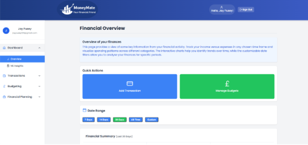

# 💸 MoneyMate

> Your personal financial friend — a web app that helps students and young adults build better financial habits with AI-powered insights, budgeting, and visualised spending analysis.

---

## 🚀 Overview

**MoneyMate** is a financial management web application designed to make personal finance simple, approachable, and insightful.  
It enables users to track income and expenses, manage budgets, set saving goals, and receive **AI-generated insights** into their financial behaviour.  

Targeted at **students and young adults** starting their financial journey, MoneyMate focuses on education, habit-building, and friendly guidance — not overwhelming complexity.

---

## ✨ Features

- 🔐 **Secure Authentication** — Firebase-backed login with email, password, and Google sign-in.  
- 📊 **Transaction Management** — Add, edit, and view expenses/income with category tagging.  
- 💡 **AI-Powered Insights**  
  - Financial Health Score (Consistency, Diversity, Control).  
  - Anomaly detection with adjustable sensitivity.  
  - Spending pattern analysis (day-of-week, time-of-month).  
  - Predictive analytics with trend forecasting.  
  - Budget optimisation engine.  
- 🏦 **Budgets & Goals** — Allocate budgets, track progress, and receive smart adjustment suggestions.  
- 📈 **Visual Data** — Interactive charts and graphs powered by Recharts.  
- 🖥 **Responsive Dashboard** — Optimised for all devices, showing net worth, income vs. expenses, and quick insights.  
- 🎮 **Gamification** — Health scores and trend tracking encourage improvement over time.  

---

## 🛠 Tech Stack

  
  
  
  

- **Frontend:** React.js (component-based UI, dynamic state management)  
- **Styling:** Tailwind CSS (utility-first design system)  
- **Backend:** Firebase + Firestore (authentication, real-time storage)  
- **Charts:** Recharts (visualising transactions, budgets, insights)  
- **Icons:** Lucide React (lightweight SVG library)  

---

## 📂 Project Structure

- /moneymate
-  /public
-  /src
-   /components
-    /dashboard
-    /css
-   /images
- package.json
- README.md

---

📸 Screenshots
Overview Dashboard	Insights Page

Transactions Page	Budget Page

📚 Research & Design Decisions
Minimalist UI inspired by Apple’s design philosophy (Kreger, 2024).

Data visualisation guided by Heer et al. (2010), emphasising clarity over complexity.

Competitive analysis of UK apps (Emma, Monzo, Money Dashboard, Plum) shaped MoneyMate’s focus on simplicity + gamification.

🔮 Future Improvements
🌍 Multi-language support with live currency conversion.

📶 Offline mode with cloud sync.

🎨 Customisable user profiles & social sharing.

♿ Accessibility features (colourblind mode, screen reader support).

📱 Notifications & reminders for bills, budgets, and goals.

🏆 Trophy & achievement system.

🧪 Lessons Learned
Importance of planning & research before coding.

Building with React & Tailwind improved front-end efficiency.

Integrating Firebase simplified authentication and real-time storage.

Developing ML insights taught valuable lessons in data processing & scalability.

User experience (simplicity, clarity, gamification) is as critical as functionality.

👤 Author
Jay Pusey
💼 Graduate Software Engineer | Passionate about AI, Data-Driven Apps & UX Design
🔗 LinkedIn • Portfolio

---
